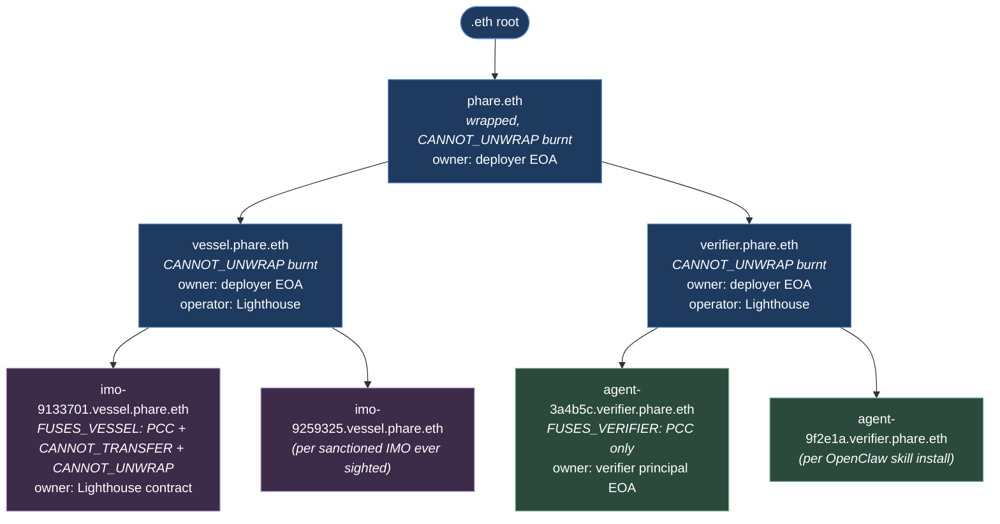
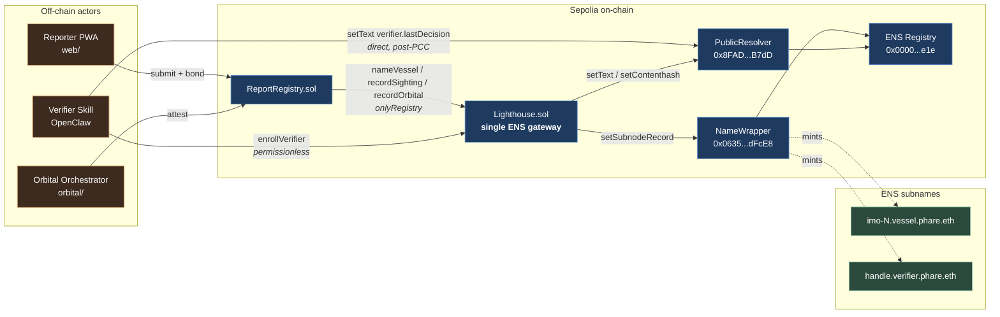
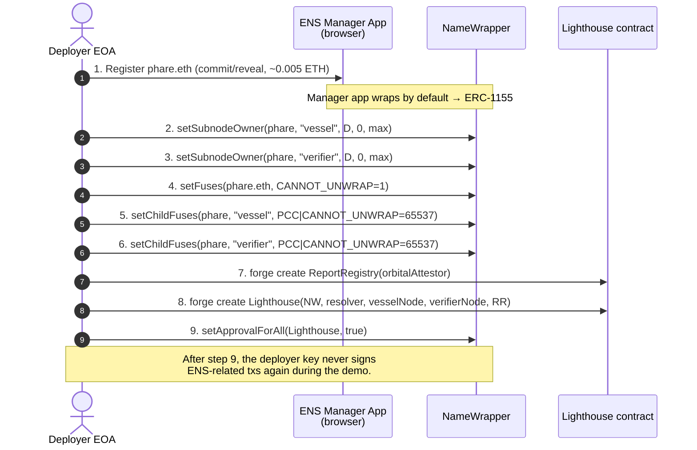
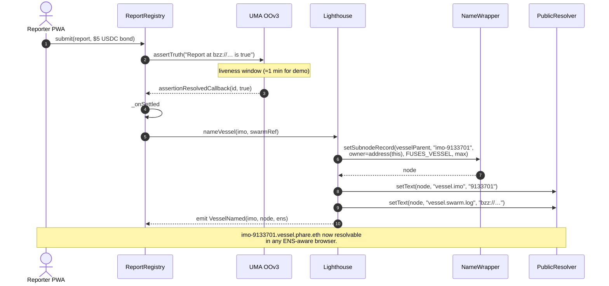
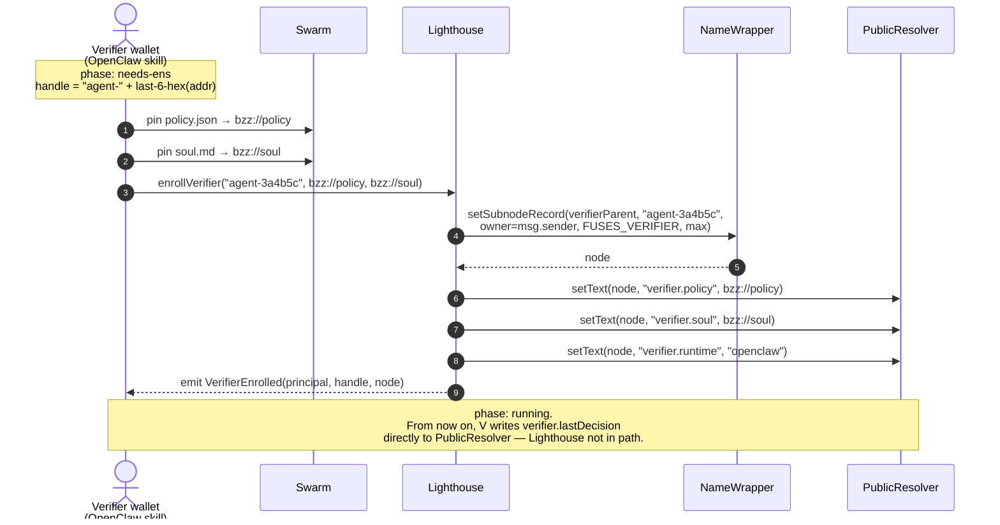
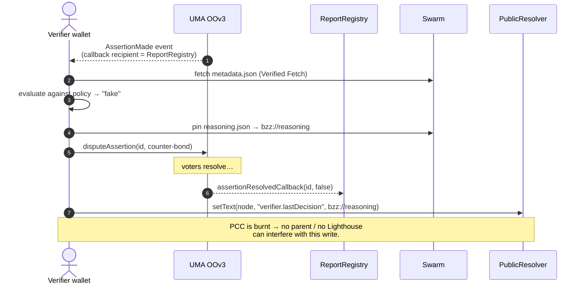
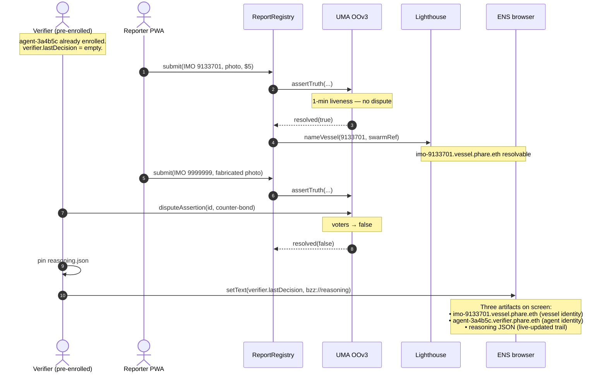

# Phare — ENS Connection Diagrams

> Mermaid diagrams of the ENS layer, derived from `LIGHTHOUSE_SPEC.md`, `ENS_INIT.md`, and `DESIGN_DOCUMENT.md`. Each diagram is self-contained and renders in any Mermaid-aware viewer (GitHub, VS Code, Obsidian, etc.).

---

## 1. ENS namespace hierarchy

The two namespaces both live under `phare.eth` on Sepolia. Vessels under `vessel.phare.eth`, verifier agents under `verifier.phare.eth`.



---

## 2. Component interactions with the ENS layer

`Lighthouse.sol` is the single contract that mediates every ENS write. `ReportRegistry` is its sole authority for vessel writes; verifier wallets self-enroll directly.



---

## 3. Pre-event setup — 9 transactions

One-shot bootstrap from a single deployer key. Sourced from `LIGHTHOUSE_SPEC.md §4` and the cast commands in `ENS_INIT.md`.



---

## 4. Trust-model asymmetry — vessel vs verifier

The most distinctive design choice in the ENS layer. Mirror-image fuse policies for two opposite trust assumptions.

```mermaid
graph TB
    subgraph vessel_side[Vessel subname<br/>imo-N.vessel.phare.eth]
        VO[Owner: Lighthouse contract]
        VF["Fuses burnt:<br/>• PARENT_CANNOT_CONTROL<br/>• CANNOT_TRANSFER<br/>• CANNOT_UNWRAP"]
        VW["Records writable by:<br/>Lighthouse, only via ReportRegistry"]
        VP[Permanence: sealed forever<br/>to the contract]
        VR[Rationale: a vessel cannot hold<br/>a wallet — identity must be<br/>tamper-evident infrastructure]
    end

    subgraph verifier_side[Verifier subname<br/>handle.verifier.phare.eth]
        AO[Owner: verifier principal EOA]
        AF["Fuses burnt:<br/>• PARENT_CANNOT_CONTROL only"]
        AW["Records writable by:<br/>the principal directly<br/>(Lighthouse only midwifes the mint)"]
        AP[Permanence: belongs to the keeper]
        AR[Rationale: a verifier IS a wallet —<br/>policy / soul / lastDecision are<br/>self-curated public statements]
    end

    VO --- VF --- VW --- VP --- VR
    AO --- AF --- AW --- AP --- AR

    classDef vessel fill:#3d2b4a,stroke:#a07fb8,color:#fff
    classDef agent  fill:#2b4a3d,stroke:#7fb89a,color:#fff
    class VO,VF,VW,VP,VR vessel
    class AO,AF,AW,AP,AR agent
```



---

## 5. Vessel — first sighting flow

A settled `ReportRegistry` event triggers the mint and initial records. From `LIGHTHOUSE_SPEC.md §5.1`.



---

## 6. Verifier — self-enrollment flow

Permissionless. Any wallet can call `enrollVerifier` and walks away owning a wrapped ERC-1155 with PCC burnt. From `LIGHTHOUSE_SPEC.md §5.4` and `DESIGN_DOCUMENT.md §4.4`.



---

## 7. Verifier — post-dispute self-write

After PCC is burnt, the verifier owns its name outright and writes its own reasoning trail. `Lighthouse` is no longer involved.



---

## 8. Records — on-chain vs Swarm

`LIGHTHOUSE_SPEC.md §6` deliberately keeps only summary fields on-chain. Everything else is reachable via one extra Swarm fetch. ~70% gas reduction vs writing the full `ENS_SPEC.md §3.1` set.

```mermaid
graph LR
    subgraph vessel_node[imo-N.vessel.phare.eth]
        direction TB
        VOC["<b>On-chain text records</b><br/>vessel.imo<br/>vessel.swarm.log<br/>vessel.sightings.count<br/>vessel.sightings.disputed<br/>vessel.orbital.image<br/>vessel.orbital.imageHash<br/>vessel.orbital.tee.prediction<br/>contenthash"]
    end

    subgraph verifier_node[handle.verifier.phare.eth]
        direction TB
        AOC["<b>On-chain text records</b><br/>verifier.policy<br/>verifier.soul<br/>verifier.runtime<br/>verifier.lastDecision<br/>contenthash"]
    end

    subgraph swarm[Swarm — content-addressed]
        direction TB
        VS["<b>Vessel dossier JSON</b><br/>full sighting history<br/>aliases / flag / AIS-dark<br/>reporter list<br/>verifier list<br/>orbital_corroboration block<br/>TEE inference doc"]
        AS["<b>Verifier artifacts</b><br/>policy JSON (full)<br/>soul markdown<br/>activity log JSON<br/>per-dispute reasoning JSON<br/>stats (derivable)"]
    end

    VOC -. vessel.swarm.log + contenthash .-> VS
    AOC -. verifier.policy / soul / lastDecision .-> AS

    classDef vessel fill:#3d2b4a,stroke:#a07fb8,color:#fff
    classDef agent  fill:#2b4a3d,stroke:#7fb89a,color:#fff
    classDef store  fill:#3d3d1f,stroke:#cccc5a,color:#fff
    class vessel_node,VOC vessel
    class verifier_node,AOC agent
    class swarm,VS,AS store
```

---

## 9. End-to-end demo slice (60 seconds, ENS perspective)

Composition of the previous flows into the live-demo timeline from `LIGHTHOUSE_SPEC.md §8`.


